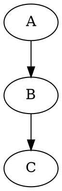
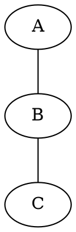
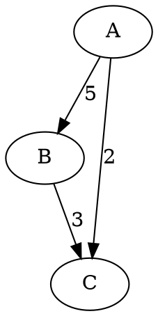
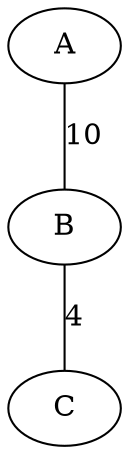
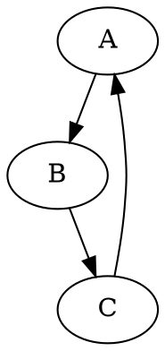
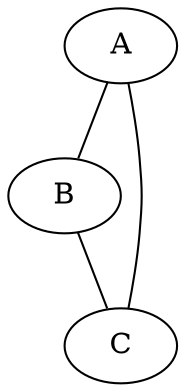
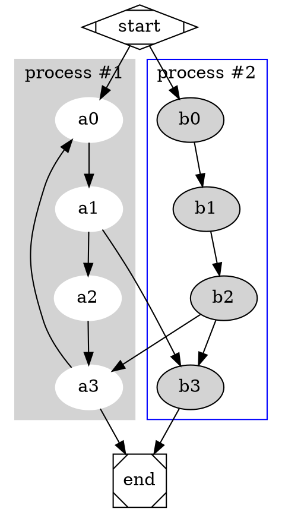

## 📚 Conceitos Básicos

- **Grafo**: Conjunto de vértices (nós) conectados por arestas (ligações).
- **Grafo direcionado (digraph)**: Arestas possuem direção (setas).
- **Grafo não direcionado (graph)**: Arestas não têm direção (linhas normais).
- **Laço**: Aresta que conecta um nó a ele mesmo.
- **Ciclo**: Caminho fechado com vértices distintos (exceto o início/fim).
- **Subgrafo**: Parte de um grafo, podendo ser usada para agrupar nós.

---

## 🏗️ Sintaxe básica (DOT language)

### 🎯 Grafo Direcionado


### 🔗 Grafo Não Direcionado


---

## 🧩 Elementos do DOT

| Elemento          | Uso                               |
|------------------|------------------------------------|
| `graph`          | Define grafo **não direcionado**   |
| `digraph`        | Define grafo **direcionado**       |
| `--`             | Aresta **não direcionada**         |
| `->`             | Aresta **direcionada**             |
| `node`           | Define propriedades dos nós        |
| `edge`           | Define propriedades das arestas    |
| `subgraph`       | Cria agrupamento de nós            |
| `label`          | Adiciona rótulo a um subgrafo ou nó|
| `style`          | Estilo visual (ex: `filled`)       |
| `color`          | Cor de nós, arestas ou clusters    |
| `shape`          | Formato do nó (ex: `circle`, `box`)|
| `rankdir=LR`     | Direção esquerda → direita         |

---

## 💡 Exemplos úteis

### 🔲 Definir formato de nó
```dot
node [shape=circle];
```

### 🟦 Subgrafo com estilo
```dot
subgraph cluster_0 {
  style=filled;
  color=lightgrey;
  node [style=filled, color=white];
  A -> B -> C;
  label="Processo 1";
}
```

### 🔁 Criar ciclo
```dot
A -> B;
B -> C;
C -> A;
```

### 🔃 Conectar entre subgrafos
```dot
A -> X;
```

---

## ✅ Dicas Gerais

- Use `graph` + `--` para grafos **não direcionados**.
- Use `digraph` + `->` para grafos **direcionados**.
- Subgrafos com `cluster_` no nome são agrupados visualmente.
- Os nós podem ter formas diferentes com `shape`.
- Pode aplicar cores, estilos e rótulos para clareza visual.

---

## 🛠️ Ferramentas

- **Graphviz Online**: [https://dreampuf.github.io/GraphvizOnline/](https://dreampuf.github.io/GraphvizOnline/)
- **VS Code Plugin**: “Graphviz Interactive Preview”

---

## ⚖️ Pesos em Arestas

Para adicionar pesos (ou custos) às arestas, utilize o atributo `label`.

### ➤ Em grafos direcionados


### ➤ Em grafos não direcionados


### 🎨 Estilizando pesos (opcional)
```dot
A -> B [label="5", color=red, fontcolor=red];
```

Use o `label` para indicar pesos visuais nas conexões entre nós.

---
---

## 📊 Exemplos por tipo de grafo

### ➤ Grafo direcionado (digraph)


### ➤ Grafo não direcionado (graph)


### ➤ Subgrafos com clusters


### ➤ Grafo com pesos nas arestas

